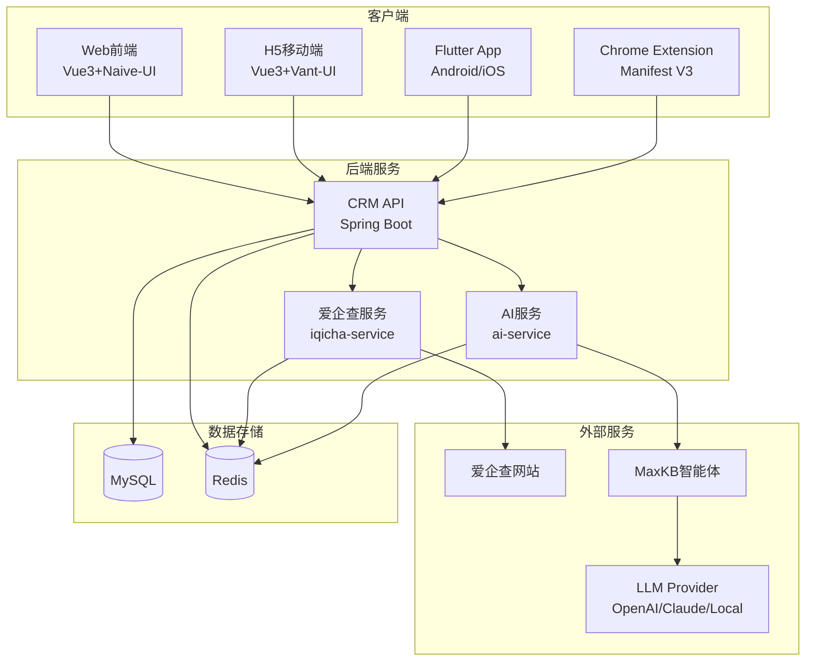
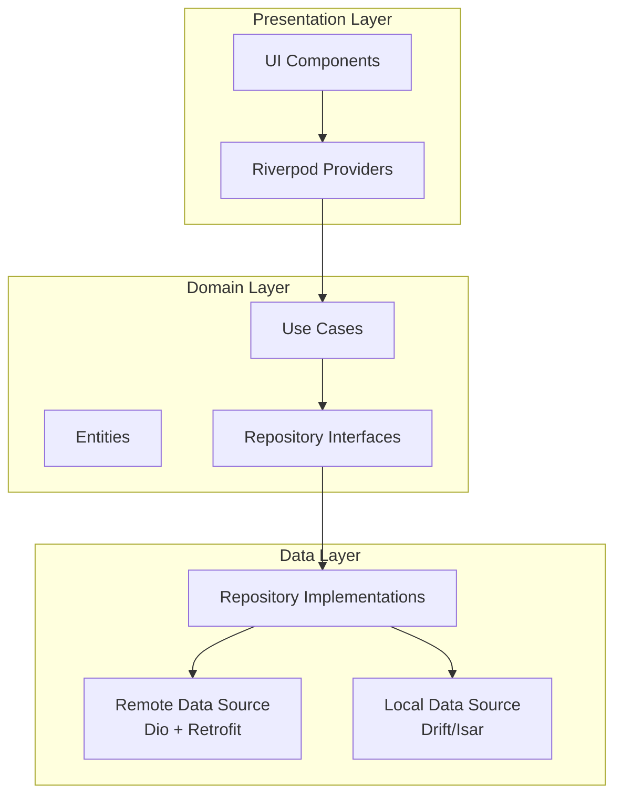
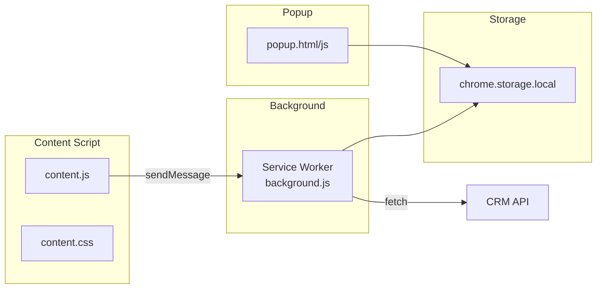
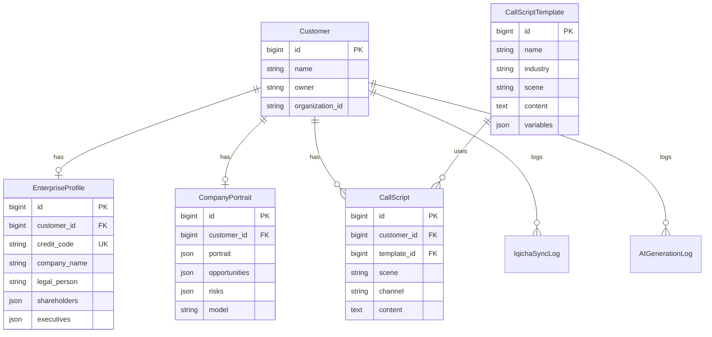
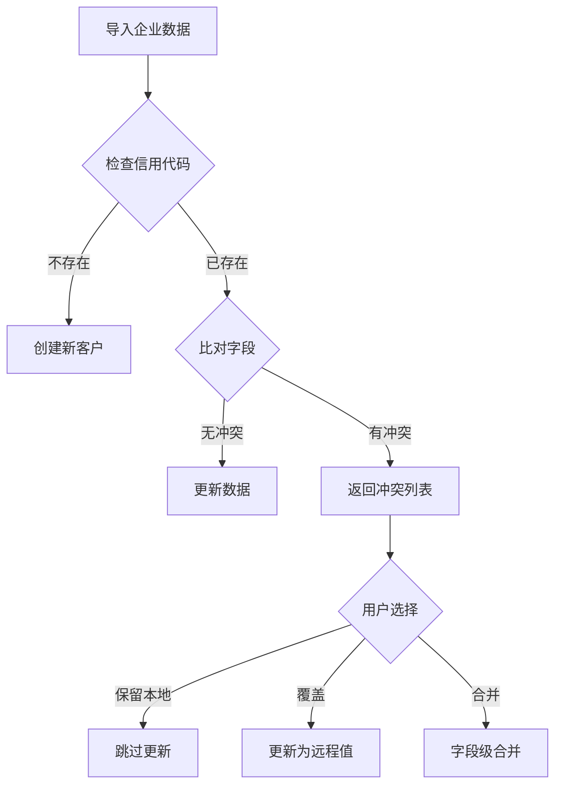

# Design Document

## Overview

本设计文档描述 CordysCRM 系统三个新功能的技术架构和实现方案：

1. **Flutter 移动端应用** - 基于 Flutter 框架开发的跨平台原生应用
2. **爱企查企业信息集成** - PC端浏览器插件 + 手机端WebView内嵌方案
3. **AI 企业画像与话术生成** - 基于 MaxKB 智能体的 AI 能力集成

## Architecture

### 整体架构图



### 模块划分

| 模块 | 职责 | 技术栈 |
|------|------|--------|
| Flutter App | 移动端原生应用 | Flutter 3.x, Riverpod, Dio, Drift |
| Chrome Extension | PC端爱企查数据采集 | Manifest V3, TypeScript |
| iqicha-service | 爱企查数据封装 | Spring Boot, Jsoup |
| ai-service | AI画像与话术生成 | Spring Boot, MaxKB SDK |

## Components and Interfaces

### 1. Flutter App 组件架构



#### Flutter 目录结构

```
cordyscrm_flutter/
├── lib/
│   ├── core/
│   │   ├── config/          # 环境配置、常量
│   │   ├── network/         # Dio客户端、拦截器
│   │   ├── di/              # 依赖注入
│   │   └── error/           # 异常处理
│   ├── data/
│   │   ├── models/          # DTO (json_serializable)
│   │   ├── sources/
│   │   │   ├── remote/      # Retrofit API定义
│   │   │   └── local/       # Drift数据库
│   │   └── repositories/    # Repository实现
│   ├── domain/
│   │   ├── entities/        # 业务实体
│   │   ├── repositories/    # Repository接口
│   │   └── usecases/        # 用例
│   ├── presentation/
│   │   ├── features/        # 按功能模块划分
│   │   │   ├── auth/
│   │   │   ├── customer/
│   │   │   ├── clue/
│   │   │   ├── business/
│   │   │   ├── enterprise/  # 爱企查WebView
│   │   │   └── ai/          # AI画像与话术
│   │   ├── routing/         # go_router配置
│   │   └── theme/           # 主题
│   └── services/
│       ├── push/            # 推送服务
│       └── sync/            # 离线同步
├── test/
└── pubspec.yaml
```

### 2. Chrome Extension 组件架构



### 3. 后端服务接口

#### 3.1 爱企查服务接口

```yaml
# POST /api/enterprise/import
# 导入企业信息到CRM
Request:
  companyName: string        # 企业名称
  creditCode: string         # 统一社会信用代码
  legalPerson: string        # 法定代表人
  registeredCapital: string  # 注册资本
  establishmentDate: string  # 成立日期
  address: string            # 注册地址
  industry: string           # 所属行业
  staffSize: string          # 人员规模
  phone: string              # 联系电话
  customerId: long           # 可选，关联到现有客户
  source: string             # 来源：chrome_extension/webview/manual

Response:
  success: boolean
  customerId: long           # 创建或更新的客户ID
  isNew: boolean             # 是否新建
  conflicts: array           # 冲突字段列表
    - field: string
      localValue: string
      remoteValue: string
```

#### 3.2 AI服务接口

```yaml
# POST /api/ai/portrait/generate
# 生成企业画像
Request:
  customerId: long
  forceRefresh: boolean

Response:
  taskId: string             # 异步任务ID
  status: string             # pending/processing/completed/failed

# GET /api/ai/portrait/{customerId}
# 获取企业画像
Response:
  customerId: long
  portrait:
    basics:                  # 基本信息
      industry: string
      scale: string
      mainProducts: string
    opportunities: array     # 商机洞察
      - title: string
        confidence: string
        source: string
    risks: array             # 风险提示
      - level: string
        text: string
    sentiments: array        # 舆情信息
      - title: string
        source: string
        sentiment: string
  generatedAt: datetime
  model: string

# POST /api/ai/script/generate
# 生成话术
Request:
  customerId: long
  scene: string              # outreach/followup/renewal
  channel: string            # phone/wechat/email
  tone: string               # professional/enthusiastic/concise
  templateId: long           # 可选，指定模板

Response:
  scriptId: long
  content: string
  model: string
```


## Data Models

### 数据库表设计

#### 1. enterprise_profile - 企业工商信息表

```sql
CREATE TABLE enterprise_profile (
  id BIGINT PRIMARY KEY AUTO_INCREMENT,
  customer_id BIGINT NOT NULL,
  iqicha_id VARCHAR(64) DEFAULT NULL,
  credit_code VARCHAR(64) NOT NULL,
  company_name VARCHAR(256) NOT NULL,
  legal_person VARCHAR(128) DEFAULT NULL,
  reg_capital DECIMAL(18,2) DEFAULT NULL,
  reg_date DATE DEFAULT NULL,
  staff_size VARCHAR(64) DEFAULT NULL,
  industry_code VARCHAR(32) DEFAULT NULL,
  industry_name VARCHAR(128) DEFAULT NULL,
  province VARCHAR(64) DEFAULT NULL,
  city VARCHAR(64) DEFAULT NULL,
  address VARCHAR(512) DEFAULT NULL,
  status VARCHAR(64) DEFAULT NULL,
  phone VARCHAR(64) DEFAULT NULL,
  email VARCHAR(128) DEFAULT NULL,
  website VARCHAR(256) DEFAULT NULL,
  shareholders JSON DEFAULT NULL,
  executives JSON DEFAULT NULL,
  risks JSON DEFAULT NULL,
  source VARCHAR(32) NOT NULL DEFAULT 'iqicha',
  last_sync_at DATETIME DEFAULT NULL,
  created_at DATETIME NOT NULL DEFAULT CURRENT_TIMESTAMP,
  updated_at DATETIME NOT NULL DEFAULT CURRENT_TIMESTAMP ON UPDATE CURRENT_TIMESTAMP,
  UNIQUE KEY uk_customer (customer_id),
  UNIQUE KEY uk_credit (credit_code),
  KEY idx_iqicha (iqicha_id),
  KEY idx_name (company_name),
  CONSTRAINT fk_ep_customer FOREIGN KEY (customer_id) REFERENCES customer(id)
);
```

#### 2. company_portrait - AI企业画像表

```sql
CREATE TABLE company_portrait (
  id BIGINT PRIMARY KEY AUTO_INCREMENT,
  customer_id BIGINT NOT NULL,
  portrait JSON NOT NULL,
  opportunities JSON DEFAULT NULL,
  risks JSON DEFAULT NULL,
  public_opinion JSON DEFAULT NULL,
  model VARCHAR(64) NOT NULL,
  version VARCHAR(32) DEFAULT 'v1',
  source VARCHAR(32) NOT NULL DEFAULT 'ai',
  generated_at DATETIME NOT NULL DEFAULT CURRENT_TIMESTAMP,
  created_at DATETIME NOT NULL DEFAULT CURRENT_TIMESTAMP,
  updated_at DATETIME NOT NULL DEFAULT CURRENT_TIMESTAMP ON UPDATE CURRENT_TIMESTAMP,
  UNIQUE KEY uk_cp_customer (customer_id),
  KEY idx_generated_at (generated_at),
  CONSTRAINT fk_cp_customer FOREIGN KEY (customer_id) REFERENCES customer(id)
);
```

#### 3. call_script_template - 话术模板表

```sql
CREATE TABLE call_script_template (
  id BIGINT PRIMARY KEY AUTO_INCREMENT,
  name VARCHAR(128) NOT NULL,
  industry VARCHAR(64) DEFAULT NULL,
  scene VARCHAR(64) NOT NULL,
  channel VARCHAR(32) DEFAULT 'phone',
  language VARCHAR(16) DEFAULT 'zh-CN',
  tone VARCHAR(32) DEFAULT 'formal',
  content TEXT NOT NULL,
  variables JSON DEFAULT NULL,
  version VARCHAR(32) DEFAULT 'v1',
  enabled TINYINT(1) NOT NULL DEFAULT 1,
  organization_id VARCHAR(64) DEFAULT NULL,
  created_by BIGINT DEFAULT NULL,
  created_at DATETIME NOT NULL DEFAULT CURRENT_TIMESTAMP,
  updated_at DATETIME NOT NULL DEFAULT CURRENT_TIMESTAMP ON UPDATE CURRENT_TIMESTAMP,
  KEY idx_template (industry, scene, channel, enabled),
  KEY idx_name (name)
);
```

#### 4. call_script - 话术记录表

```sql
CREATE TABLE call_script (
  id BIGINT PRIMARY KEY AUTO_INCREMENT,
  customer_id BIGINT NOT NULL,
  opportunity_id BIGINT DEFAULT NULL,
  template_id BIGINT DEFAULT NULL,
  scene VARCHAR(64) NOT NULL,
  channel VARCHAR(32) DEFAULT 'phone',
  language VARCHAR(16) DEFAULT 'zh-CN',
  tone VARCHAR(32) DEFAULT 'formal',
  tags JSON DEFAULT NULL,
  content TEXT NOT NULL,
  model VARCHAR(64) DEFAULT NULL,
  generated_at DATETIME DEFAULT NULL,
  created_by BIGINT DEFAULT NULL,
  created_at DATETIME NOT NULL DEFAULT CURRENT_TIMESTAMP,
  updated_at DATETIME NOT NULL DEFAULT CURRENT_TIMESTAMP ON UPDATE CURRENT_TIMESTAMP,
  KEY idx_customer_scene (customer_id, scene),
  KEY idx_template (template_id),
  CONSTRAINT fk_cs_customer FOREIGN KEY (customer_id) REFERENCES customer(id),
  CONSTRAINT fk_cs_template FOREIGN KEY (template_id) REFERENCES call_script_template(id)
);
```

#### 5. iqicha_sync_log - 爱企查同步日志表

```sql
CREATE TABLE iqicha_sync_log (
  id BIGINT PRIMARY KEY AUTO_INCREMENT,
  operator_id BIGINT DEFAULT NULL,
  customer_id BIGINT DEFAULT NULL,
  iqicha_id VARCHAR(64) DEFAULT NULL,
  action VARCHAR(32) NOT NULL,
  request_params JSON DEFAULT NULL,
  response_code INT DEFAULT NULL,
  response_msg VARCHAR(256) DEFAULT NULL,
  diff_snapshot JSON DEFAULT NULL,
  cost DECIMAL(10,2) DEFAULT NULL,
  created_at DATETIME NOT NULL DEFAULT CURRENT_TIMESTAMP,
  KEY idx_customer_action (customer_id, action),
  KEY idx_iqicha (iqicha_id),
  KEY idx_created (created_at)
);
```

#### 6. ai_generation_log - AI生成日志表

```sql
CREATE TABLE ai_generation_log (
  id BIGINT PRIMARY KEY AUTO_INCREMENT,
  customer_id BIGINT DEFAULT NULL,
  scene VARCHAR(32) NOT NULL,
  model VARCHAR(64) NOT NULL,
  provider VARCHAR(32) NOT NULL,
  prompt_hash CHAR(64) DEFAULT NULL,
  tokens_prompt INT DEFAULT NULL,
  tokens_completion INT DEFAULT NULL,
  latency_ms INT DEFAULT NULL,
  status VARCHAR(16) NOT NULL,
  error_msg VARCHAR(256) DEFAULT NULL,
  cost DECIMAL(10,4) DEFAULT NULL,
  created_by BIGINT DEFAULT NULL,
  created_at DATETIME NOT NULL DEFAULT CURRENT_TIMESTAMP,
  KEY idx_customer_scene (customer_id, scene),
  KEY idx_status (status),
  KEY idx_created (created_at)
);
```

#### 7. integration_config - 集成配置表

```sql
CREATE TABLE integration_config (
  id BIGINT PRIMARY KEY AUTO_INCREMENT,
  config_key VARCHAR(64) NOT NULL,
  config_value TEXT NOT NULL,
  encrypted TINYINT(1) NOT NULL DEFAULT 0,
  organization_id VARCHAR(64) DEFAULT NULL,
  description VARCHAR(256) DEFAULT NULL,
  created_at DATETIME NOT NULL DEFAULT CURRENT_TIMESTAMP,
  updated_at DATETIME NOT NULL DEFAULT CURRENT_TIMESTAMP ON UPDATE CURRENT_TIMESTAMP,
  UNIQUE KEY uk_key_org (config_key, organization_id)
);
```

### 实体关系图




## Correctness Properties

*A property is a characteristic or behavior that should hold true across all valid executions of a system-essentially, a formal statement about what the system should do. Properties serve as the bridge between human-readable specifications and machine-verifiable correctness guarantees.*

基于需求文档的验收标准分析，以下是可测试的正确性属性：

### Property 1: 分页数据一致性
*For any* 客户列表分页请求，返回的数据量应该等于请求的 pageSize（最后一页除外），且总数应该与实际数据库记录数一致。
**Validates: Requirements 1.3**

### Property 2: 表单验证规则一致性
*For any* 客户信息输入，Flutter App 和 Web 端应用相同的验证规则，对于相同的输入应该产生相同的验证结果。
**Validates: Requirements 1.4**

### Property 3: 离线数据缓存完整性
*For any* 用户相关的客户、线索和跟进记录，在离线状态下应该能够从本地存储完整读取，且数据与最后一次同步时的服务器数据一致。
**Validates: Requirements 1.6**

### Property 4: 离线同步数据一致性
*For any* 本地变更操作，在设备恢复在线后，服务器应该收到与本地变更完全相同的数据，且变更顺序应该保持一致。
**Validates: Requirements 1.7**

### Property 5: 配置存储往返一致性
*For any* Chrome Extension 配置（CRM地址、JWT Token），保存后读取应该得到完全相同的值。
**Validates: Requirements 2.1**

### Property 6: DOM数据提取完整性
*For any* 有效的爱企查企业详情页 HTML，Chrome Extension 应该能够提取出企业名称和统一社会信用代码（必填字段）。
**Validates: Requirements 2.3**

### Property 7: API请求格式正确性
*For any* Chrome Extension 发送的企业数据，请求应该包含正确的 Authorization 头和 JSON 格式的请求体。
**Validates: Requirements 2.4**

### Property 8: 企业去重准确性
*For any* 两条企业记录，如果统一社会信用代码相同，则应该被识别为重复记录。
**Validates: Requirements 2.5**

### Property 9: 冲突检测准确性
*For any* 两条企业记录的相同字段，如果值不同，则该字段应该出现在冲突列表中。
**Validates: Requirements 2.6**

### Property 10: WebView会话持久性
*For any* 用户在 WebView 中成功登录爱企查后，关闭并重新打开 WebView 应该能够复用之前的登录会话。
**Validates: Requirements 3.2**

### Property 11: 企业数据保存完整性
*For any* 通过 WebView 导入的企业信息，保存到 CRM 后应该能够查询到完全相同的数据。
**Validates: Requirements 3.6**

### Property 12: 会话失效检测准确性
*For any* WebView 请求返回登录页面重定向或 401 状态码，应该被识别为会话失效。
**Validates: Requirements 3.7**

### Property 13: 剪贴板企业名称识别
*For any* 包含中文企业名称（2-50个字符，包含"公司"、"集团"、"有限"等关键词）的文本，应该被识别为潜在的企业名称。
**Validates: Requirements 4.1**

### Property 14: 爱企查链接解析
*For any* 有效的爱企查企业详情页链接，应该能够正确解析出企业标识符。
**Validates: Requirements 4.2**

### Property 15: 企业搜索结果相关性
*For any* 企业名称搜索词（≥2个字符），返回的候选列表中每个企业名称应该包含搜索词或其拼音首字母。
**Validates: Requirements 4.3**

### Property 16: 画像数据分类正确性
*For any* 企业画像数据，应该能够正确分类到基本信息、商机洞察、风险提示、相关舆情四个类别中。
**Validates: Requirements 5.2**

### Property 17: AI调用参数完整性
*For any* 画像生成请求，发送给 AI 服务的 Prompt 应该包含企业的基本信息（名称、行业、规模等）。
**Validates: Requirements 5.5**

### Property 18: 画像存储往返一致性
*For any* AI 生成的企业画像，存储到数据库后查询应该得到完全相同的数据结构。
**Validates: Requirements 5.6**

### Property 19: AI调用日志完整性
*For any* AI 服务调用，应该记录包含模型名称、Token消耗、耗时、状态的日志记录。
**Validates: Requirements 5.8**

### Property 20: 话术生成参数传递
*For any* 话术生成请求，发送给 AI 服务的请求应该包含用户选择的场景、渠道、语气参数。
**Validates: Requirements 6.5**

### Property 21: 话术模板变量解析
*For any* 包含变量占位符（如 {{公司名称}}）的话术模板，应该能够正确识别并列出所有变量。
**Validates: Requirements 7.3**

### Property 22: 话术保存往返一致性
*For any* 用户编辑并保存的话术，保存后查询应该得到完全相同的内容。
**Validates: Requirements 6.8**

### Property 23: 话术历史记录完整性
*For any* 用户在同一会话中生成的多次话术，应该全部保留在历史记录中，且顺序与生成顺序一致。
**Validates: Requirements 6.10**

### Property 24: 模板列表分类正确性
*For any* 话术模板列表查询，返回的模板应该按行业和场景正确分类。
**Validates: Requirements 7.1**

### Property 25: 模板状态影响可用性
*For any* 被禁用的话术模板，不应该出现在话术生成时的可用模板列表中。
**Validates: Requirements 7.5**

### Property 26: 凭证加密存储
*For any* 存储到数据库的第三方服务凭证，存储的值应该是加密后的密文，且能够正确解密还原。
**Validates: Requirements 8.2, 9.1**

### Property 27: API限流有效性
*For any* 超过配置限额的 API 调用请求，应该被拒绝并返回限流错误。
**Validates: Requirements 8.6**

### Property 28: 操作日志完整性
*For any* 爱企查服务调用，应该记录包含操作人、目标企业、操作类型、时间的日志。
**Validates: Requirements 9.2**

### Property 29: 数据变更历史追溯
*For any* 企业信息导入操作，应该记录数据变更历史，包含变更前后的值和来源标识。
**Validates: Requirements 9.4**

## Error Handling

### 1. 网络错误处理

| 场景 | 处理方式 |
|------|----------|
| 网络不可用 | Flutter App 切换到离线模式，显示缓存数据 |
| 请求超时 | 自动重试最多3次，间隔递增（1s, 2s, 4s） |
| 服务器错误(5xx) | 显示友好错误提示，提供重试按钮 |
| 认证失败(401) | 跳转到登录页面，清除本地Token |

### 2. 爱企查集成错误处理

| 场景 | 处理方式 |
|------|----------|
| 会话失效 | 提示用户重新登录爱企查 |
| 验证码触发 | 允许用户在WebView中手动完成验证 |
| 页面结构变化 | 记录错误日志，提示用户联系管理员 |
| 数据提取失败 | 显示具体失败字段，允许手动补充 |

### 3. AI服务错误处理

| 场景 | 处理方式 |
|------|----------|
| AI服务不可用 | 显示错误提示，建议稍后重试 |
| 生成超时 | 异步任务超时后标记失败，允许重新生成 |
| 内容审核失败 | 过滤敏感内容，返回安全版本 |
| 配额耗尽 | 提示管理员充值或调整配额 |

### 4. 数据冲突处理




## Testing Strategy

### 测试框架选择

| 层级 | 技术栈 | 测试框架 |
|------|--------|----------|
| Flutter App | Dart | flutter_test + mockito + fast_check |
| Chrome Extension | TypeScript | Jest + fast-check |
| 后端服务 | Java | JUnit 5 + jqwik (PBT) |
| 集成测试 | - | Playwright |

### 单元测试策略

#### Flutter App 单元测试
- Repository 层：Mock 远程和本地数据源，测试数据转换逻辑
- UseCase 层：Mock Repository，测试业务逻辑
- Provider 层：测试状态管理逻辑

#### 后端服务单元测试
- Service 层：Mock Repository，测试业务逻辑
- Controller 层：Mock Service，测试请求处理
- 工具类：测试加密、解析、格式化等工具方法

### 属性测试策略

属性测试（Property-Based Testing）用于验证系统的正确性属性。每个属性测试应该：
- 运行至少 100 次迭代
- 使用智能生成器约束输入空间
- 标注对应的正确性属性编号

#### 示例：企业去重属性测试

```java
// **Feature: crm-mobile-enterprise-ai, Property 8: 企业去重准确性**
@Property(tries = 100)
void duplicateDetectionByCreditCode(
    @ForAll @StringLength(min = 18, max = 18) String creditCode,
    @ForAll @StringLength(min = 2, max = 50) String companyName1,
    @ForAll @StringLength(min = 2, max = 50) String companyName2
) {
    EnterpriseProfile profile1 = new EnterpriseProfile();
    profile1.setCreditCode(creditCode);
    profile1.setCompanyName(companyName1);
    
    EnterpriseProfile profile2 = new EnterpriseProfile();
    profile2.setCreditCode(creditCode);
    profile2.setCompanyName(companyName2);
    
    boolean isDuplicate = enterpriseService.checkDuplicate(profile1, profile2);
    
    assertThat(isDuplicate).isTrue();
}
```

#### 示例：配置存储往返属性测试

```typescript
// **Feature: crm-mobile-enterprise-ai, Property 5: 配置存储往返一致性**
import fc from 'fast-check';

describe('Chrome Extension Config Storage', () => {
  it('should preserve config after save and load', () => {
    fc.assert(
      fc.property(
        fc.record({
          crmUrl: fc.webUrl(),
          jwtToken: fc.string({ minLength: 10, maxLength: 500 })
        }),
        async (config) => {
          await saveConfig(config);
          const loaded = await loadConfig();
          expect(loaded.crmUrl).toBe(config.crmUrl);
          expect(loaded.jwtToken).toBe(config.jwtToken);
        }
      ),
      { numRuns: 100 }
    );
  });
});
```

### 集成测试策略

#### API 集成测试
- 使用 TestContainers 启动 MySQL 和 Redis
- 测试完整的请求-响应流程
- 验证数据库状态变更

#### E2E 测试
- 使用 Playwright 测试 Web 前端
- 使用 Flutter Integration Test 测试移动端
- 测试关键用户流程

### 测试覆盖率目标

| 模块 | 行覆盖率 | 分支覆盖率 |
|------|----------|------------|
| 核心业务逻辑 | ≥80% | ≥70% |
| 数据访问层 | ≥70% | ≥60% |
| 工具类 | ≥90% | ≥80% |
| UI组件 | ≥60% | ≥50% |

### 测试数据生成器

为属性测试定义智能数据生成器：

```java
// 企业信息生成器
@Provide
Arbitrary<EnterpriseProfile> enterpriseProfiles() {
    return Combinators.combine(
        Arbitraries.strings().ofMinLength(18).ofMaxLength(18).alpha().numeric(), // creditCode
        Arbitraries.strings().ofMinLength(2).ofMaxLength(50), // companyName
        Arbitraries.strings().ofMinLength(2).ofMaxLength(20), // legalPerson
        Arbitraries.bigDecimals().between(BigDecimal.ZERO, new BigDecimal("100000000")), // regCapital
        Arbitraries.of("信息技术", "制造业", "金融业", "零售业") // industry
    ).as((code, name, legal, capital, industry) -> {
        EnterpriseProfile profile = new EnterpriseProfile();
        profile.setCreditCode(code);
        profile.setCompanyName(name);
        profile.setLegalPerson(legal);
        profile.setRegCapital(capital);
        profile.setIndustryName(industry);
        return profile;
    });
}
```

## Security Considerations

### 1. 认证与授权
- 所有 API 接口使用 JWT Token 认证
- 基于 RBAC 的权限控制
- Token 过期时间：访问令牌 2 小时，刷新令牌 7 天

### 2. 数据加密
- 敏感配置使用 AES-256 加密存储
- 传输层使用 HTTPS/TLS 1.3
- 数据库连接使用 SSL

### 3. 第三方凭证安全
- 爱企查 Cookie 加密存储，不在日志中输出
- AI API Key 使用环境变量或密钥管理服务
- 定期轮换凭证

### 4. 审计日志
- 记录所有敏感操作（导入、生成、配置变更）
- 日志包含操作人、时间、IP、操作内容
- 日志保留期限：至少 180 天

### 5. 输入验证
- 所有用户输入进行 XSS 过滤
- SQL 参数化查询防止注入
- 文件上传类型和大小限制
