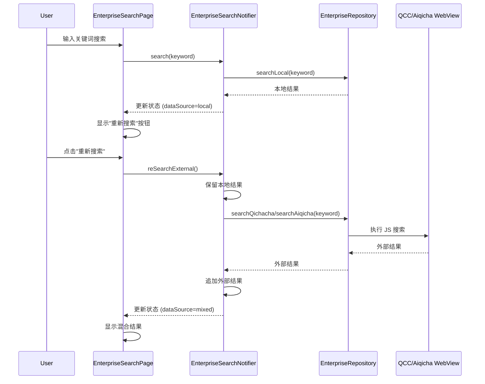

# Design Document: Enterprise Re-Search Feature

## Overview

本设计文档描述了企业搜索页面"重新搜索"功能的技术实现方案。该功能允许用户在获得 CRM 本地搜索结果后，点击"重新搜索"按钮从外部数据源（企查查/爱企查）获取更多结果，并将外部结果追加到本地结果之后显示。

## Architecture

### 组件交互流程



## Components and Interfaces

### 1. EnterpriseSearchState 扩展

在现有的 `EnterpriseSearchState` 中添加重新搜索相关状态：

```dart
class EnterpriseSearchState {
  // 现有字段...
  final bool isSearching;
  final List<Enterprise> results;
  final int total;
  final String? error;
  final String keyword;
  final EnterpriseSearchDataSource? dataSource;
  
  // 新增字段
  final bool isReSearching;  // 重新搜索加载状态
  final String? reSearchError;  // 重新搜索错误信息
  
  // 辅助方法
  bool get canReSearch => 
      dataSource == EnterpriseSearchDataSource.local && 
      results.isNotEmpty &&
      !isSearching &&
      !isReSearching;
}
```

### 2. EnterpriseSearchNotifier 扩展

添加重新搜索方法：

```dart
class EnterpriseSearchNotifier extends StateNotifier<EnterpriseSearchState> {
  // 现有方法...
  
  /// 重新搜索外部数据源
  /// 
  /// 保留本地结果，追加外部结果。
  /// [keyword] 可选参数，允许调用方传入当前输入框的值，解决输入框与 state.keyword 不同步的问题。
  Future<void> reSearchExternal({String? keyword}) async {
    if (!state.canReSearch) return;
    
    // 优先使用传入的 keyword，否则使用 state 中保存的 keyword
    final resolvedKeyword = (keyword ?? state.keyword).trim();
    if (resolvedKeyword.length < 2) {
      state = state.copyWith(
        reSearchError: ReSearchError(
          type: ReSearchErrorType.unknown,
          message: '请输入至少2个字符的企业名称',
        ),
      );
      return;
    }
    
    final localResults = state.results;
    
    state = state.copyWith(
      isReSearching: true,
      clearReSearchError: true,
      keyword: resolvedKeyword, // 同步更新 keyword
    );
    
    try {
      // 根据当前数据源类型搜索
      final externalResult = await _searchExternalSource(resolvedKeyword);
      
      if (externalResult.success) {
        // 去重：移除与本地结果重复的外部结果
        final localCreditCodes = localResults.map((e) => e.creditCode).toSet();
        final uniqueExternalResults = externalResult.items.where(
          (ext) => !localCreditCodes.contains(ext.creditCode)
        ).toList();
        
        // 追加外部结果到本地结果之后
        final mergedResults = [...localResults, ...uniqueExternalResults];
        
        state = state.copyWith(
          isReSearching: false,
          results: mergedResults,
          total: mergedResults.length,
          dataSource: EnterpriseSearchDataSource.mixed,
        );
        
        // 如果没有找到新结果，触发通知
        if (uniqueExternalResults.isEmpty) {
          _notifyNoNewResults();
        }
      } else {
        // 根据错误类型创建结构化错误
        final errorType = _classifyError(externalResult.message);
        state = state.copyWith(
          isReSearching: false,
          reSearchError: ReSearchError(
            type: errorType,
            message: externalResult.message ?? '重新搜索失败',
          ),
        );
      }
    } catch (e) {
      state = state.copyWith(
        isReSearching: false,
        reSearchError: ReSearchError(
          type: ReSearchErrorType.unknown,
          message: '重新搜索失败: $e',
        ),
      );
    }
  }
  
  /// 根据错误消息分类错误类型
  ReSearchErrorType _classifyError(String? message) {
    if (message == null) return ReSearchErrorType.unknown;
    
    final lowerMessage = message.toLowerCase();
    if (lowerMessage.contains('webview') || lowerMessage.contains('未打开')) {
      return ReSearchErrorType.webViewNotReady;
    } else if (lowerMessage.contains('登录') || lowerMessage.contains('验证码')) {
      return ReSearchErrorType.authenticationRequired;
    } else if (lowerMessage.contains('网络') || lowerMessage.contains('超时')) {
      return ReSearchErrorType.networkOrTimeout;
    }
    return ReSearchErrorType.unknown;
  }
  
  /// 通知用户未找到新结果（由 UI 层实现）
  void _notifyNoNewResults() {
    // 这个方法会在 UI 层通过监听状态变化来实现
    // 可以通过添加一个临时标志位来触发 SnackBar
  }
}
```

### 3. UI 组件修改

#### 3.1 数据来源横幅 (_buildDataSourceBanner)

修改现有的 `_buildDataSourceBanner` 方法，在本地数据源时显示"重新搜索"按钮：

```dart
Widget _buildDataSourceBanner(EnterpriseSearchState state) {
  // 现有代码...
  
  return Container(
    // 现有样式...
    child: Row(
      children: [
        Icon(icon, size: 18, color: color),
        const SizedBox(width: 8),
        Expanded(
          child: Text('结果来源：$label', ...),
        ),
        // 新增：重新搜索按钮
        if (state.canReSearch)
          _buildReSearchButton(state),
      ],
    ),
  );
}

Widget _buildReSearchButton(EnterpriseSearchState state) {
  final dataSource = ref.read(enterpriseDataSourceProvider);
  final dataSourceName = dataSource.displayName;
  
  return TextButton.icon(
    onPressed: state.isReSearching 
        ? null 
        : () => ref.read(enterpriseSearchProvider.notifier).reSearchExternal(),
    icon: state.isReSearching
        ? const SizedBox(
            width: 16,
            height: 16,
            child: CircularProgressIndicator(strokeWidth: 2),
          )
        : const Icon(Icons.refresh, size: 18),
    label: Text(state.isReSearching ? '搜索中...' : '搜索$dataSourceName'),
    style: TextButton.styleFrom(
      padding: const EdgeInsets.symmetric(horizontal: 8),
      minimumSize: Size.zero,
      tapTargetSize: MaterialTapTargetSize.shrinkWrap,
    ),
  );
}
```

#### 3.2 混合结果标签

更新 `dataSourceLabel` getter 以支持混合结果的详细标签：

```dart
String? get dataSourceLabel {
  return switch (dataSource) {
    EnterpriseSearchDataSource.local => 'CRM 本地库',
    EnterpriseSearchDataSource.iqicha => '爱企查',
    EnterpriseSearchDataSource.qcc => '企查查',
    EnterpriseSearchDataSource.mixed => _getMixedLabel(),
    _ => null,
  };
}

String _getMixedLabel() {
  // 根据当前外部数据源类型返回标签
  final externalType = _ref.read(enterpriseDataSourceTypeProvider);
  return switch (externalType) {
    EnterpriseDataSourceType.qcc => '本地 + 企查查',
    EnterpriseDataSourceType.iqicha => '本地 + 爱企查',
    _ => '本地 + 外部数据源',
  };
}
```

## Data Models

### EnterpriseSearchState 更新

```dart
/// 重新搜索错误类型
enum ReSearchErrorType {
  /// WebView 未准备好，无法执行JS调用
  webViewNotReady,
  /// 需要登录或验证码
  authenticationRequired,
  /// 网络问题或API调用超时
  networkOrTimeout,
  /// 未知错误
  unknown,
}

/// 结构化的重新搜索错误
class ReSearchError {
  const ReSearchError({
    required this.type,
    this.message = '',
  });

  final ReSearchErrorType type;
  final String message; // 原始错误信息，用于调试

  String getUserMessage() {
    return switch (type) {
      ReSearchErrorType.webViewNotReady => '搜索组件未就绪，请先加载企查查页面。',
      ReSearchErrorType.authenticationRequired => '需要登录或验证，请先在企查查页面完成操作。',
      ReSearchErrorType.networkOrTimeout => '网络连接失败或搜索超时，请稍后重试。',
      ReSearchErrorType.unknown => '发生未知错误，请重试或联系支持。',
    };
  }

  bool get canNavigateToWebView => type == ReSearchErrorType.authenticationRequired;
}

class EnterpriseSearchState {
  const EnterpriseSearchState({
    this.isSearching = false,
    this.results = const [],
    this.total = 0,
    this.error,
    this.keyword = '',
    this.dataSource,
    this.isReSearching = false,  // 新增
    this.reSearchError,  // 新增：使用结构化错误
  });

  final bool isSearching;
  final List<Enterprise> results;
  final int total;
  final String? error;
  final String keyword;
  final EnterpriseSearchDataSource? dataSource;
  final bool isReSearching;  // 新增
  final ReSearchError? reSearchError;  // 新增：使用结构化错误

  bool get hasError => error != null;
  bool get hasResults => results.isNotEmpty;
  bool get hasReSearchError => reSearchError != null;  // 新增
  
  /// 是否可以执行重新搜索
  bool get canReSearch =>
      dataSource == EnterpriseSearchDataSource.local &&
      results.isNotEmpty &&
      !isSearching &&
      !isReSearching;

  EnterpriseSearchState copyWith({
    bool? isSearching,
    List<Enterprise>? results,
    int? total,
    String? error,
    String? keyword,
    EnterpriseSearchDataSource? dataSource,
    bool? isReSearching,
    ReSearchError? reSearchError,
    bool clearError = false,
    bool clearDataSource = false,
    bool clearReSearchError = false,
  }) {
    return EnterpriseSearchState(
      isSearching: isSearching ?? this.isSearching,
      results: results ?? this.results,
      total: total ?? this.total,
      error: clearError ? null : (error ?? this.error),
      keyword: keyword ?? this.keyword,
      dataSource: clearDataSource ? null : (dataSource ?? this.dataSource),
      isReSearching: isReSearching ?? this.isReSearching,
      reSearchError: clearReSearchError ? null : (reSearchError ?? this.reSearchError),
    );
  }
}
```

## Correctness Properties

*A property is a characteristic or behavior that should hold true across all valid executions of a system—essentially, a formal statement about what the system should do. Properties serve as the bridge between human-readable specifications and machine-verifiable correctness guarantees.*

### Property 1: Re-search button visibility depends on data source

*For any* EnterpriseSearchState, the `canReSearch` property should return `true` if and only if:
- `dataSource` is `EnterpriseSearchDataSource.local`
- `results` is not empty
- `isSearching` is `false`
- `isReSearching` is `false`

**Validates: Requirements 1.1, 1.2, 1.3, 1.4**

### Property 2: Re-search preserves keyword

*For any* re-search operation, the keyword used for external search must be identical to the keyword stored in the current state.

**Validates: Requirements 2.1**

### Property 3: Result ordering after re-search

*For any* successful re-search operation with local results `L` and external results `E`, the merged results list should be `L ++ E` (local results followed by external results, preserving original order within each group).

**Validates: Requirements 2.3, 3.1, 4.1**

### Property 4: Data source updates to mixed after re-search

*For any* successful re-search operation, the resulting state's `dataSource` should be `EnterpriseSearchDataSource.mixed`.

**Validates: Requirements 2.4**

### Property 5: Error handling preserves local results

*For any* failed re-search operation, the local results in the state should remain unchanged from before the operation.

**Validates: Requirements 2.5, 4.2**

### Property 6: Clear action clears all results

*For any* clear operation on a state with mixed results, the resulting state should have empty results and no data source.

**Validates: Requirements 4.3**

## Error Handling

### 重新搜索错误处理

使用结构化错误代替简单字符串，提供更丰富的错误信息和用户指导：

#### 错误类型定义

```dart
enum ReSearchErrorType {
  /// WebView 未准备好，无法执行JS调用
  webViewNotReady,
  /// 需要登录或验证码
  authenticationRequired,
  /// 网络问题或API调用超时
  networkOrTimeout,
  /// 未知错误
  unknown,
}

class ReSearchError {
  const ReSearchError({
    required this.type,
    this.message = '',
  });

  final ReSearchErrorType type;
  final String message; // 原始错误信息，用于调试

  String getUserMessage() {
    return switch (type) {
      ReSearchErrorType.webViewNotReady => '搜索组件未就绪，请先加载企查查页面。',
      ReSearchErrorType.authenticationRequired => '需要登录或验证，请先在企查查页面完成操作。',
      ReSearchErrorType.networkOrTimeout => '网络连接失败或搜索超时，请稍后重试。',
      ReSearchErrorType.unknown => '发生未知错误，请重试或联系支持。',
    };
  }

  bool get canNavigateToWebView => type == ReSearchErrorType.authenticationRequired;
}
```

#### UI 层错误处理

```dart
void _showErrorFeedback(BuildContext context, ReSearchError error) {
  String errorMessage = error.getUserMessage();
  String? actionLabel;
  VoidCallback? onAction;

  if (error.canNavigateToWebView) {
    actionLabel = '去处理';
    onAction = () {
      context.push(AppRoutes.enterpriseWebView);
    };
  }
  
  ScaffoldMessenger.of(context).showSnackBar(
    SnackBar(
      content: Text(errorMessage),
      action: actionLabel != null 
        ? SnackBarAction(label: actionLabel, onPressed: onAction!)
        : null,
    ),
  );
}
```

### 错误分类逻辑

在 `EnterpriseSearchNotifier` 中根据错误消息分类：

```dart
ReSearchErrorType _classifyError(String? message) {
  if (message == null) return ReSearchErrorType.unknown;
  
  final lowerMessage = message.toLowerCase();
  if (lowerMessage.contains('webview') || lowerMessage.contains('未打开')) {
    return ReSearchErrorType.webViewNotReady;
  } else if (lowerMessage.contains('登录') || lowerMessage.contains('验证码')) {
    return ReSearchErrorType.authenticationRequired;
  } else if (lowerMessage.contains('网络') || lowerMessage.contains('超时')) {
    return ReSearchErrorType.networkOrTimeout;
  }
  return ReSearchErrorType.unknown;
}
```

### 错误显示

重新搜索错误通过 `ReSearchError` 对象存储，在 UI 中通过 SnackBar 显示，根据错误类型提供不同的操作建议，不影响已有的本地结果展示。

## Testing Strategy

### 单元测试

1. **EnterpriseSearchState 测试**
   - 测试 `canReSearch` 在各种状态下的返回值
   - 测试 `copyWith` 方法正确处理新字段
   - 测试 `ReSearchError` 的 `getUserMessage()` 方法

2. **EnterpriseSearchNotifier 测试**
   - 测试 `reSearchExternal` 方法的状态转换
   - 测试去重逻辑正确性
   - 测试错误分类逻辑
   - 测试"未找到新结果"场景

### 属性测试（高优先级）

使用 Dart 的 `glados` 库进行属性测试，优先实现以下 3 个关键属性：

#### 1. Property 5: Error handling preserves local results（最高优先级）

*For any* failed re-search operation, the local results in the state should remain unchanged from before the operation.

**验证方法：**
- 生成随机的本地结果列表
- 模拟各种失败场景（网络错误、WebView 未就绪等）
- 验证失败后本地结果列表完全不变

**重要性：** 数据丢失是严重 Bug，此属性保证了用户已有的本地搜索结果不会丢失。

**Validates: Requirements 2.5, 4.2**

#### 2. Property 3: Result ordering and merging after re-search（高优先级）

*For any* successful re-search operation with local results `L` and external results `E`, the merged results list should be `L ++ uniqueExternal(E)` where `uniqueExternal(E)` excludes duplicates based on `creditCode`.

**验证方法：**
- 生成随机本地结果和外部结果
- 确保部分外部结果与本地结果重复（相同 creditCode）
- 验证合并后：本地结果在前、去重后的外部结果在后
- 验证重复的外部结果被正确移除

**重要性：** 这是功能的核心逻辑，直接关系到功能是否按预期工作。

**Validates: Requirements 2.3, 3.1, 3.4, 4.1**

#### 3. Property 6: Clear action clears all results（中等优先级）

*For any* clear operation on a state with mixed results, the resulting state should have empty results and no data source.

**验证方法：**
- 生成随机的混合结果状态
- 调用 `clear()` 方法
- 验证所有字段被正确重置

**重要性：** 保证状态可以被正确重置，避免旧数据污染新搜索。

**Validates: Requirements 4.3**

### Widget 测试

1. 测试"重新搜索"按钮在正确条件下显示/隐藏
2. 测试按钮点击触发正确的 Provider 方法
3. 测试加载状态正确显示
4. 测试错误 SnackBar 根据错误类型显示不同内容
5. 测试"未找到新结果"的 SnackBar 显示
