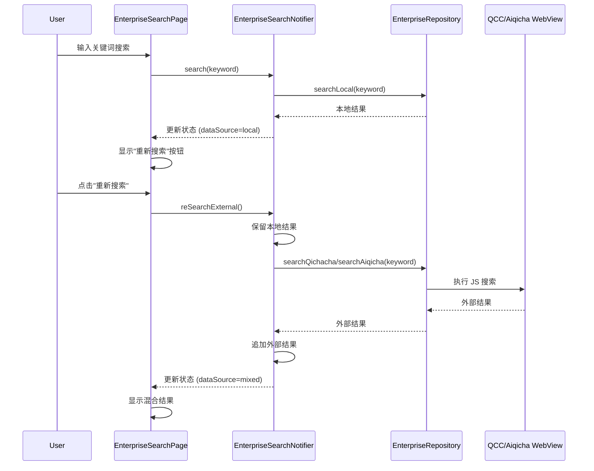

# Design Document: Enterprise Re-Search Feature

## Overview

本设计文档描述了企业搜索页面"重新搜索"功能的技术实现方案。该功能允许用户在获得 CRM 本地搜索结果后，点击"重新搜索"按钮从外部数据源（企查查/爱企查）获取更多结果，并将外部结果追加到本地结果之后显示。

## Architecture

### 组件交互流程



## Components and Interfaces

### 1. EnterpriseSearchState 扩展

在现有的 `EnterpriseSearchState` 中添加重新搜索相关状态：

```dart
class EnterpriseSearchState {
  // 现有字段...
  final bool isSearching;
  final List<Enterprise> results;
  final int total;
  final String? error;
  final String keyword;
  final EnterpriseSearchDataSource? dataSource;
  
  // 新增字段
  final bool isReSearching;  // 重新搜索加载状态
  final String? reSearchError;  // 重新搜索错误信息
  
  // 辅助方法
  bool get canReSearch => 
      dataSource == EnterpriseSearchDataSource.local && 
      results.isNotEmpty &&
      !isSearching &&
      !isReSearching;
}
```

### 2. EnterpriseSearchNotifier 扩展

添加重新搜索方法：

```dart
class EnterpriseSearchNotifier extends StateNotifier<EnterpriseSearchState> {
  // 现有方法...
  
  /// 重新搜索外部数据源
  /// 保留本地结果，追加外部结果
  Future<void> reSearchExternal() async {
    if (!state.canReSearch) return;
    
    final keyword = state.keyword;
    final localResults = state.results;
    
    state = state.copyWith(
      isReSearching: true,
      clearReSearchError: true,
    );
    
    try {
      // 根据当前数据源类型搜索
      final externalResult = await _searchExternalSource(keyword);
      
      if (externalResult.success) {
        // 追加外部结果到本地结果之后
        final mergedResults = [...localResults, ...externalResult.items];
        state = state.copyWith(
          isReSearching: false,
          results: mergedResults,
          total: mergedResults.length,
          dataSource: EnterpriseSearchDataSource.mixed,
        );
      } else {
        state = state.copyWith(
          isReSearching: false,
          reSearchError: externalResult.message,
        );
      }
    } catch (e) {
      state = state.copyWith(
        isReSearching: false,
        reSearchError: '重新搜索失败: $e',
      );
    }
  }
}
```

### 3. UI 组件修改

#### 3.1 数据来源横幅 (_buildDataSourceBanner)

修改现有的 `_buildDataSourceBanner` 方法，在本地数据源时显示"重新搜索"按钮：

```dart
Widget _buildDataSourceBanner(EnterpriseSearchState state) {
  // 现有代码...
  
  return Container(
    // 现有样式...
    child: Row(
      children: [
        Icon(icon, size: 18, color: color),
        const SizedBox(width: 8),
        Expanded(
          child: Text('结果来源：$label', ...),
        ),
        // 新增：重新搜索按钮
        if (state.canReSearch)
          _buildReSearchButton(state),
      ],
    ),
  );
}

Widget _buildReSearchButton(EnterpriseSearchState state) {
  final dataSource = ref.read(enterpriseDataSourceProvider);
  final dataSourceName = dataSource.displayName;
  
  return TextButton.icon(
    onPressed: state.isReSearching 
        ? null 
        : () => ref.read(enterpriseSearchProvider.notifier).reSearchExternal(),
    icon: state.isReSearching
        ? const SizedBox(
            width: 16,
            height: 16,
            child: CircularProgressIndicator(strokeWidth: 2),
          )
        : const Icon(Icons.refresh, size: 18),
    label: Text(state.isReSearching ? '搜索中...' : '搜索$dataSourceName'),
    style: TextButton.styleFrom(
      padding: const EdgeInsets.symmetric(horizontal: 8),
      minimumSize: Size.zero,
      tapTargetSize: MaterialTapTargetSize.shrinkWrap,
    ),
  );
}
```

#### 3.2 混合结果标签

更新 `dataSourceLabel` getter 以支持混合结果的详细标签：

```dart
String? get dataSourceLabel {
  return switch (dataSource) {
    EnterpriseSearchDataSource.local => 'CRM 本地库',
    EnterpriseSearchDataSource.iqicha => '爱企查',
    EnterpriseSearchDataSource.qcc => '企查查',
    EnterpriseSearchDataSource.mixed => _getMixedLabel(),
    _ => null,
  };
}

String _getMixedLabel() {
  // 根据当前外部数据源类型返回标签
  final externalType = _ref.read(enterpriseDataSourceTypeProvider);
  return switch (externalType) {
    EnterpriseDataSourceType.qcc => '本地 + 企查查',
    EnterpriseDataSourceType.iqicha => '本地 + 爱企查',
    _ => '本地 + 外部数据源',
  };
}
```

## Data Models

### EnterpriseSearchState 更新

```dart
class EnterpriseSearchState {
  const EnterpriseSearchState({
    this.isSearching = false,
    this.results = const [],
    this.total = 0,
    this.error,
    this.keyword = '',
    this.dataSource,
    this.isReSearching = false,  // 新增
    this.reSearchError,  // 新增
  });

  final bool isSearching;
  final List<Enterprise> results;
  final int total;
  final String? error;
  final String keyword;
  final EnterpriseSearchDataSource? dataSource;
  final bool isReSearching;  // 新增
  final String? reSearchError;  // 新增

  bool get hasError => error != null;
  bool get hasResults => results.isNotEmpty;
  bool get hasReSearchError => reSearchError != null;  // 新增
  
  /// 是否可以执行重新搜索
  bool get canReSearch =>
      dataSource == EnterpriseSearchDataSource.local &&
      results.isNotEmpty &&
      !isSearching &&
      !isReSearching;

  EnterpriseSearchState copyWith({
    bool? isSearching,
    List<Enterprise>? results,
    int? total,
    String? error,
    String? keyword,
    EnterpriseSearchDataSource? dataSource,
    bool? isReSearching,
    String? reSearchError,
    bool clearError = false,
    bool clearDataSource = false,
    bool clearReSearchError = false,
  }) {
    return EnterpriseSearchState(
      isSearching: isSearching ?? this.isSearching,
      results: results ?? this.results,
      total: total ?? this.total,
      error: clearError ? null : (error ?? this.error),
      keyword: keyword ?? this.keyword,
      dataSource: clearDataSource ? null : (dataSource ?? this.dataSource),
      isReSearching: isReSearching ?? this.isReSearching,
      reSearchError: clearReSearchError ? null : (reSearchError ?? this.reSearchError),
    );
  }
}
```

## Correctness Properties

*A property is a characteristic or behavior that should hold true across all valid executions of a system—essentially, a formal statement about what the system should do. Properties serve as the bridge between human-readable specifications and machine-verifiable correctness guarantees.*

### Property 1: Re-search button visibility depends on data source

*For any* EnterpriseSearchState, the `canReSearch` property should return `true` if and only if:
- `dataSource` is `EnterpriseSearchDataSource.local`
- `results` is not empty
- `isSearching` is `false`
- `isReSearching` is `false`

**Validates: Requirements 1.1, 1.2, 1.3, 1.4**

### Property 2: Re-search preserves keyword

*For any* re-search operation, the keyword used for external search must be identical to the keyword stored in the current state.

**Validates: Requirements 2.1**

### Property 3: Result ordering after re-search

*For any* successful re-search operation with local results `L` and external results `E`, the merged results list should be `L ++ E` (local results followed by external results, preserving original order within each group).

**Validates: Requirements 2.3, 3.1, 4.1**

### Property 4: Data source updates to mixed after re-search

*For any* successful re-search operation, the resulting state's `dataSource` should be `EnterpriseSearchDataSource.mixed`.

**Validates: Requirements 2.4**

### Property 5: Error handling preserves local results

*For any* failed re-search operation, the local results in the state should remain unchanged from before the operation.

**Validates: Requirements 2.5, 4.2**

### Property 6: Clear action clears all results

*For any* clear operation on a state with mixed results, the resulting state should have empty results and no data source.

**Validates: Requirements 4.3**

## Error Handling

### 重新搜索错误处理

1. **WebView 未就绪**：显示错误提示，引导用户先打开企查查/爱企查页面
2. **网络错误**：显示错误提示，保留本地结果
3. **搜索超时**：显示超时提示，保留本地结果
4. **验证码/登录要求**：显示提示，引导用户去 WebView 页面处理

### 错误显示

重新搜索错误通过 `reSearchError` 字段存储，在 UI 中通过 SnackBar 或 Toast 显示，不影响已有的本地结果展示。

## Testing Strategy

### 单元测试

1. **EnterpriseSearchState 测试**
   - 测试 `canReSearch` 在各种状态下的返回值
   - 测试 `copyWith` 方法正确处理新字段

2. **EnterpriseSearchNotifier 测试**
   - 测试 `reSearchExternal` 方法的状态转换
   - 测试错误处理逻辑

### 属性测试

使用 Dart 的 `glados` 或 `test_random` 库进行属性测试：

1. **Property 1**: 生成随机 EnterpriseSearchState，验证 `canReSearch` 逻辑
2. **Property 3**: 生成随机本地结果和外部结果，验证合并顺序
3. **Property 5**: 模拟失败场景，验证本地结果不变

### Widget 测试

1. 测试"重新搜索"按钮在正确条件下显示/隐藏
2. 测试按钮点击触发正确的 Provider 方法
3. 测试加载状态正确显示
